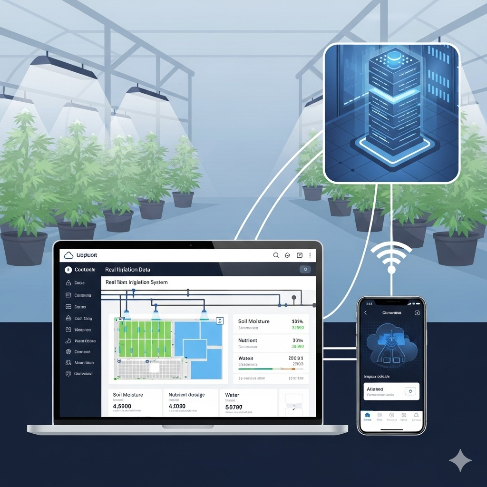
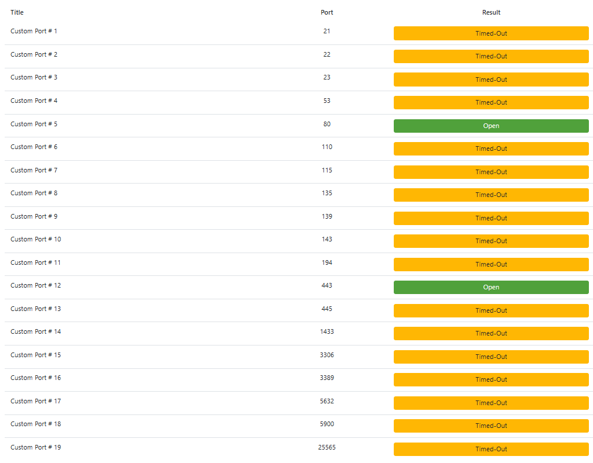
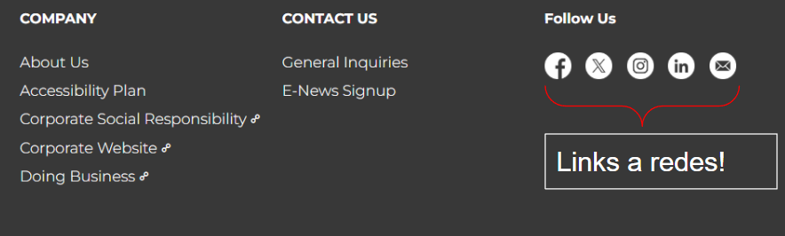

# Alumno: Martin Duarte

# Sistema víctima ( Muy breve descripción del trabajo práctico con link si hay)

- El sistema víctima va a ser el sistema de riego el cual tiene la posibilidad de correr en varias plataformas.

- El propósito de este sistema es manejar invernaderos inteligentes de plantas de cannabis para uso medicinal. Una vez que la planta creció el cliente puede elegir venderla o quedársela para sí.

- Una opción es una plataforma web, que puede ser accedida através de una IP pública por usuario y contraseña. La segunda opción es através de una aplicación de celular con S.O Android. 
- Los datos de las plantas y su pertenencia de cada cliente son almacenados en una base de datos en AWS para su procesamiento, pago mensual, usuario y contraseña. 

# Objetivo del ataque
- Hipotesis 1: Aprovechando que la plataforma web tiene una tienda online, podríamos modificar los precios de algunas plantas (para pasar de ser percibido) para que los pagos se envíen a una cuenta a la cual el atacante tenga acceso.
- Hipótesis 2: Podría modificar los precios de la tienda y que parte de los mismos se envíen a una cuenta fantasta y otros a la cuenta del sistema (aprovechando % diferenciados, colocando descuentos que propociona la página).
- Hipótesis 3: Podría obtener información de los dispositivos que realizan pagos en la página para poder obtener datos de los clientes (bancarios, billeteras virtuales, conversaciones privadas que permitan rédito económico). También direcciones en de donde viven de manera de poder enviar ataques via hardware. 

**DECIDO** tomar la hipótesis 1, me parece las mas atractiva, donde puedo obtener mayores beneficios e incluso a largo plazo.

## Reconnaissance

Durante el reconocimiento comenzaría haciendo las siguientes acciones:

- (**T1595**) - Active Scanning: con el propósito de identificar puertos comunes de comunicación (21:FTP, 22:SSH, 1433 MSSQL, 3306 MySQL, 3389 Remote Desktop, 5632 PCAnywhare).

    Utilicé: https://dnschecker.org/port-scanner.php

- **(T1593.001)** Search Open Websites/Domains:
    - **(T1593.001) - Social Media**: Redes sociales que se encuentren en el sitio, búsqueda de seguidores, empleados o incluso dueños. 

    

    - **(T1591.001) - Determine Physical Locations**: Lugares donde pudieran se pudieran encontrar los activos.

    

- **(T1597) - Search Closed Sources**:
    - **(T1597.002)** Purchase Technical Data: con el objetivo de conocer el circuito de compra y poder obtener cuentas a las cuales se gira el dinero, CUIT, CUIL, entidades bancarias haría una compra de algún elemento de la tienda.
    

## Weaponization
### Acceso a los recursos: 

De manera de no ser detectado, comenzaría el registro en la página web con un email temporal obtenido de: 

https://temp-mail.org/en/

Y una red VPN que me permita que el ataque no pueda ser rastreado. Usaría TOR:

https://www.torproject.org/

De esta manera puedo no usar una cuenta personal, ni tampoco tener que crear una con datos falsos.

## Delivery
Luego del reconocimiento, se pudo encontrar una vulnerabilidad que permitirá inyectar un "_skimmer_".

El _skimmer_ está diseñado para interceptar los datos del formulario de compra, modificar el precio de la planta y la cuenta de destino del pago antes de que se envíe al servidor.

De manera de tener mayor probabilidad de éxito se logra incorporar el skimmer en estas tres variantes de la página a atacar: 

- **[T1189]  - Drive-by Compromise:** Se inyecta un script que captura los datos del pago de los clientes. ¿Cómo? 
    - **[T1583.008]**: Se contratan ads maliciosos que aparecen en la misma página (se depende que el usuario entre por error).    
- **[T1566] - Phishing:** Se envían varios correos electrónicos con la intención de que los empleados/clientes/conocidos del local hagan click simulando el origen ser la página atacada, ofreciendo acciones como nuevas funcionalidades o actualizaciones disponibles.
    - **(T1566.002 - Spearphishing Link):** Entre   los links que puedo enviar en el __Phishing__ el atacante se esconde en algunas particularidades como aprovechar el esquema de URL como la aceptación de formatos de nombre de host basados en números enteros o hexadecimales y el descarte automático de texto antes de un símbolo "@".
    Ejemplo, **hxxp://google.com@1157586937**

- **(T1105) - Ingress Tool Transfer** : Después de obtener acceso inicial (por ejemplo, a través del spearphishing), el atacante transfiere el script de manipulación de pagos al servidor web de la aplicación por métodos:

    **Windows**: copy o finger.

    **Linux**: curl, scp, sftp.

## Exploitation

Por medio de la fase de **Delivery** se consiguieron credenciales de un administrador o empleado con acceso a la gestión de la tienda online.

- **(T1078) - Valid Accounts**: El atacante utiliza las credenciales válidas que obtuvo a través de phishing para autenticarse en la plataforma de administración de la tienda.

- **(T1087.001) - Account Discovery**: El atacante explora los permisos de la cuenta robada para determinar qué acciones puede realizar. Descubre que la cuenta tiene acceso a la base de datos de productos y a la configuración de pagos.

## Installation
Al tener las credenciales comprometidas, como atacante puede utilizar la técnica: 

**(T1546.002) - Event Triggered Execution: Image File Execution Options Injection:** De manera de poder persistir el código malicioso, se configura una tarea programada del sistema para verificar la existencia del script. 
Si el script se encuentra en el sistema, no se hace nada, en caso de no estar en el lugar esperado, se desencadena una re-instalación del script como un proceso de inicio del sistema operativo. 

Opcional: Se buscaría programar el script para ejecutarse al mismo tiempo que se hacen las actualizaciones de paquetes de software, por ejemplo __"Windows Update"__ o al momento de ejecutar **"apt-upgrade"** en Linux. De esta manera sería menos probable ser detectado.

## Command & Control

Después de que un cliente introduce sus datos en el formulario de pago, el skimmer envía una solicitud **HTTP POST** a un dominio controlado por el atacante. 

Esta solicitud contiene los datos de la tarjeta de crédito, el valor real del producto y el nuevo precio manipulado.

 La URL utilizada para esta comunicación puede estar disfrazada para que parezca una solicitud normal a una imagen, un script de análisis o un recurso de la tienda, como 
 
 __"canabis.shop.com/data/analytics.js"__

## Actions on Objetives